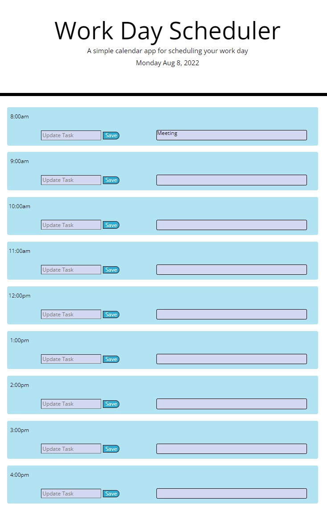

UW Coding Bootcamp assignment 5: Work Day Scheduler
Building a work day scheduler that allows a user to type in a task and have it populate on screen. The time blocks are supposed to change colors depending on the time of day.

Github Repository Link:
https://github.com/snovelli1021/Assignment5

Github Pages Link:
https://snovelli1021.github.io/Assignment5/

